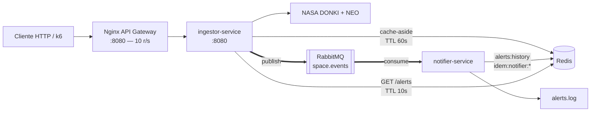

# Solar Shield — Microsserviços de Clima Espacial

## Integrantes

| Nome | Responsabilidade |
|------|-----------------|
| Enzo Croquer           | RM 553213 |
| Felipe Mion de Andrade | RM 553715 |
| Samuel Guilherme Monte | RM 554154 |

---

## Visão Geral

O Solar Shield é um backend de microsserviços que consome dados públicos da NASA (DONKI para tempestades geomagnéticas e NEO para asteroides próximos), classifica cada evento por severidade usando o índice Kp, publica alertas em fila assíncrona via RabbitMQ e expõe uma API REST protegida por Nginx com rate limiting e cache Redis.

---

## Arquitetura



---

## Regras de Negócio

### RN1 — Classificação por Kp

| Faixa Kp | severityLevel | emergencyNotification |
|----------|---------------|-----------------------|
| Kp ≤ 4   | low           | false                 |
| 5 ≤ Kp ≤ 7 | moderate    | false                 |
| Kp ≥ 8   | severe        | true                  |

- Quando o evento DONKI vier sem Kp direto, extrai o maior `kpIndex` de `allKpIndex[]`.

### RN2 — Enriquecimento com NEO

Para eventos `severe`, agrega a contagem de asteroides com `is_potentially_hazardous_asteroid = true` na janela de ±1 dia do evento via NEO Feed.

### RN3 — Idempotência por event_id

O consumer usa `SET key NX EX 86400` no Redis. Se o `event_id` já existir, a mensagem é descartada com `ack` — nunca processada duas vezes, mesmo em redelivery.

---

## Justificativa do TTL do Cache

O endpoint `GET /api/space-weather/current` usa TTL de **60 segundos**. A NASA DONKI publica notificações de tempestade geomagnética com granularidade de minutos, e o índice Kp é medido em janelas de 3 horas — portanto um cache de 1 minuto absorve picos de tráfego sem perda relevante de frescor. Além disso, a `DEMO_KEY` da NASA tem limite de 30 req/h; com cache de 60s, a aplicação nunca ultrapassa 1 req/min nesse endpoint.

---

## Como Rodar

```bash
# 1. Clone o repositório
git clone https://github.com/SEU_USUARIO/solar-shield.git
cd solar-shield

# 2. Configure a API key da NASA (opcional, DEMO_KEY já está no padrão)
cp .env.example .env
# Edite .env e coloque sua chave de https://api.nasa.gov

# 3. Sobe tudo com um único comando
docker compose up --build
```

### Serviços disponíveis após o `up`

| Serviço | URL |
|---------|-----|
| API Gateway (Nginx) | http://localhost:8080 |
| RabbitMQ Management | http://localhost:15672 (guest/guest) |
| Redis | localhost:6379 |

---

## Endpoints

| Método | Rota | Descrição |
|--------|------|-----------|
| GET | `/health` | Health check (sem rate limit) |
| GET | `/api/space-weather/current` | Estado atual — Kp + classificação (com cache Redis, TTL 60s) |
| POST | `/api/ingest/gst` | Ingestão DONKI — busca NASA, classifica e publica na fila |
| GET | `/api/alerts` | Lista os últimos 50 alertas processados (cache Redis, TTL 10s) |
| GET | `/api/neo/feed?date=YYYY-MM-DD` | NEOs do dia (direto na NASA, sem cache) |

### Exemplo de resposta — GET /api/space-weather/current

```json
{
  "kp_index": 6.3,
  "classification": "moderate",
  "emergency_notification": false,
  "captured_at": "2026-06-09T18:42:00Z",
  "source": "NASA DONKI",
  "cache": "HIT"
}
```

O header `X-Cache` indica `HIT` ou `MISS` a cada resposta.

---

## Testes

```bash
# Unitários (rodam offline, sem Docker)
npm test

# Saída esperada: 3 suítes, todos os testes verdes
```

### Cobertura dos testes

| Arquivo | O que testa |
|---------|-------------|
| `tests/test_rn1_classify.test.js` | RN1 — fronteiras do Kp (0, 4, 5, 7, 8, 9) + extractMaxKp |
| `tests/test_rn3_idempotency.test.js` | RN3 — mesmo event_id processado 1x, liberação em falha |
| `tests/test_cache_and_neo.test.js` | Cache HIT/MISS, erro não cacheado, parsing NEO hazardous |

---

## Smoke Test k6

```bash
# Via Docker (sem instalar k6)
docker run --rm --network host -i grafana/k6 run - < k6/smoke.js

# Salvar resultado
docker run --rm --network host -i grafana/k6 run - < k6/smoke.js 2>&1 | tee k6/result.txt
```

Configuração: **10 VUs por 10 segundos**, threshold p95 < 500ms, taxa de erro < 1%.

---

## Demonstração do Rate Limiting (Nginx)

```bash
for i in $(seq 1 50); do curl -s -o /dev/null -w "%{http_code}\n" http://localhost/api/space-weather/current; done
```

Após o burst de 20 requisições, as seguintes retornam `429 Too Many Requests`.

---

## Demonstração do Cache

```bash
# Primeira chamada — MISS (vai à NASA)
curl -v http://localhost:8080/api/space-weather/current 2>&1 | grep X-Cache

# Segunda chamada — HIT (serve do Redis)
curl -v http://localhost:8080/api/space-weather/current 2>&1 | grep X-Cache

# Ver TTL no Redis
docker exec solar-redis redis-cli TTL space:current:weather
```

---

## Estrutura de Pastas

```
solar-shield/
├── README.md
├── docker-compose.yml
├── nginx.conf
├── .env.example
├── .gitignore
├── package.json            ← Jest raiz (testes unitários)
├── src/
│   ├── ingestor-service/
│   │   ├── Dockerfile
│   │   ├── package.json
│   │   └── src/
│   │       ├── index.js    ← Express app (endpoints REST)
│   │       ├── classify.js ← RN1 (classifyKp, extractMaxKp)
│   │       ├── nasa.js     ← Cliente NASA com retry/backoff
│   │       └── rabbit.js   ← Producer RabbitMQ
│   └── notifier-service/
│       ├── Dockerfile
│       ├── package.json
│       └── src/
│           ├── index.js    ← Consumer RabbitMQ
│           ├── handler.js  ← RN3 (idempotência)
│           └── alert.js    ← Envio do alerta (log/webhook)
├── tests/
│   ├── test_rn1_classify.test.js
│   ├── test_rn3_idempotency.test.js
│   └── test_cache_and_neo.test.js
└── k6/
    └── smoke.js
```

---

## Roteiro de Defesa (8 passos)

1. Abrir GitHub, mostrar README e diagrama Mermaid renderizado
2. `docker compose up --build` — todos containers sobem, mostrar painel RabbitMQ em `:15672`
3. `curl -X POST http://localhost:8080/api/ingest/gst` — dispara ingestão da NASA
4. `curl http://localhost:8080/api/alerts` — validar `X-Cache: MISS` na 1ª chamada, `HIT` na 2ª
5. Loop de 50 requisições — mostrar respostas `429` após burst
6. `POST /api/ingest/gst` duas vezes em sequência — log do notifier mostra `Duplicate ignored event_id=...`
7. `npm test` — 3 suítes, todos verdes (RN1 + RN3)
8. `docker run --rm --network host -i grafana/k6 run - < k6/smoke.js` — mostrar p95 e taxa de erro


## Vídeo Pitch
https://www.youtube.com/watch?v=gbFt9A2UWvM
